SMART E-COMMERCE PERFORMANCE ANALYSIS REPORT
============================================
**1. Introduction**
--------------------

This document presents a detailed performance analysis of the Smart E-Commerce application, based on runtime measurements collected from profiling screenshots.
The primary goal is to evaluate how efficiently the application uses CPU, memory, and threads under different workloads and to verify whether optimization efforts were successful.

The analysis is based on screenshots taken from the following tools:

**_Apache JMeter_** – load generation

Java Mission Control (JMC) with Flight Recorder – CPU, threads, memory, and method profiling

**_VisualVM_** – JVM runtime observation

Each section below clearly explains:

* What was measured

* What the numbers mean

* Why the result is good or bad

* What conclusions can be drawn

**2. Application Startup Resource Usage Observation**
========================================

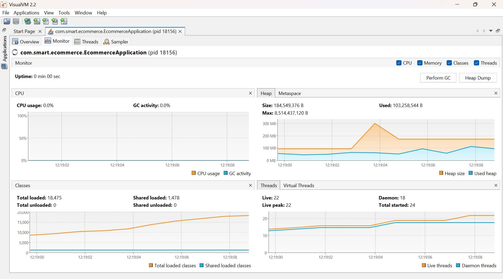

When the application starts:

CPU usage briefly increases

Memory usage rises as the JVM initializes

**Explanation**
--------------

This behavior is normal and expected because:

The JVM loads core classes

Spring Boot initializes the application context

Beans, security filters, database connections, and caches are created

**Key Point**
--------------

A temporary spike during startup does not indicate poor performance.
What matters is what happens after startup completes.

**3. Resource Stabilization After Startup Observation** 
=======================================================
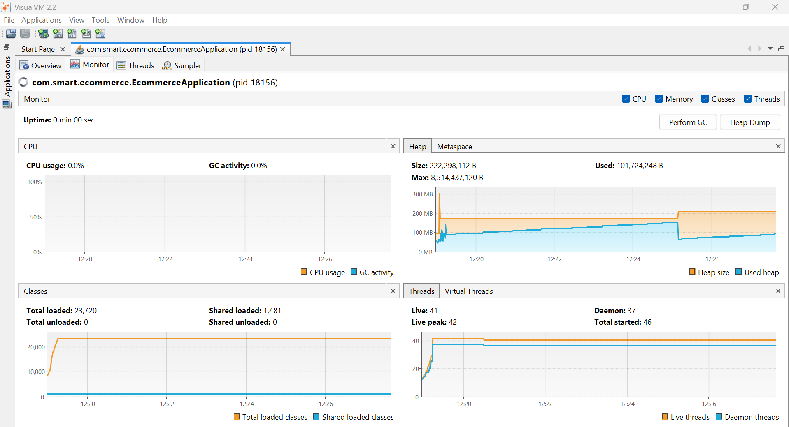

After startup completes:

CPU usage drops to a very low baseline

Heap memory stops growing and stabilizes

**Explanation**
---------------

This shows that:

No background threads are wasting CPU

No objects are continuously allocated in memory

The application is idle and waiting for requests

**Conclusion**
--------------

The application is stable when idle, which indicates:

No memory leaks

No unnecessary background processing

**4. Single Request Performance (Login Request) Observation** 
==================
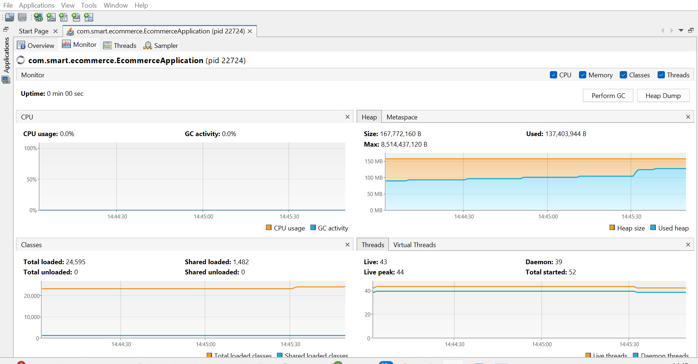

A single login request was sent to the application:

CPU usage remained almost unchanged

Memory usage did not noticeably increase

No additional threads were created

**Explanation**
---------------

This means:

The login logic executes quickly

No expensive computation or blocking operation is involved

The request lifecycle is short and efficient

**Conclusion**
--------------

The login method is well optimized and suitable for high-frequency use.

**5. Load Test Configuration Observation** 
=======================

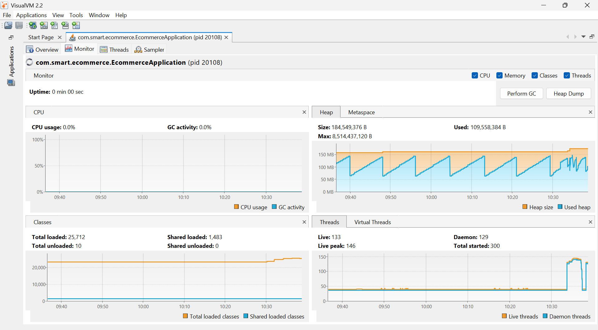

A load test was executed using Apache JMeter with:

100 concurrent users

Requests running in an infinite loop

**Explanation**
---------------

**This simulates:**

Many users accessing the system at the same time

Continuous traffic instead of short bursts

This type of test is important to expose:

* CPU bottlenecks
* Memory leaks
* Thread starvation

**6. Runtime Monitoring Overview Observation**
==============================================
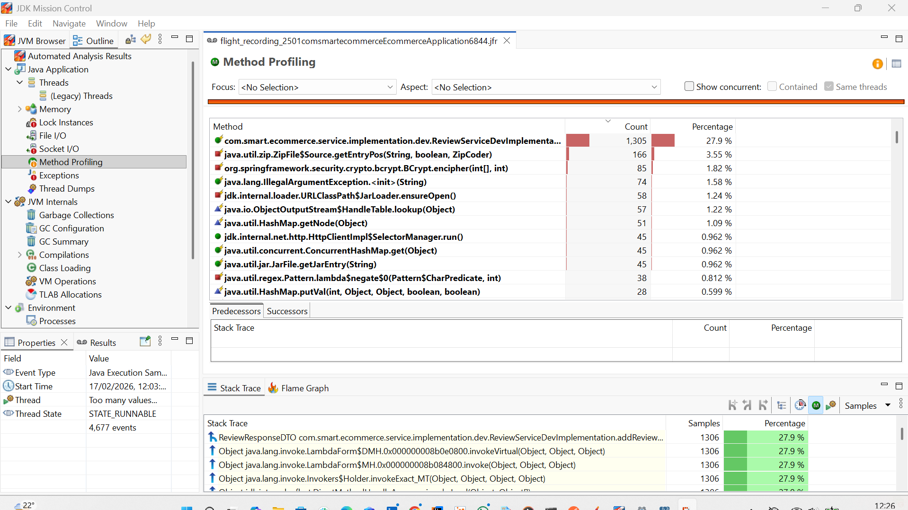

During the load test:

The application remained responsive

No JVM crashes or freezes occurred

Resource usage stayed controlled

**Explanation**
--------------

**This indicates that:**

The system can handle sustained concurrency

No immediate scalability issues appear under load

**7. CPU Usage Analysis at Peak Load Observation** 
==========================

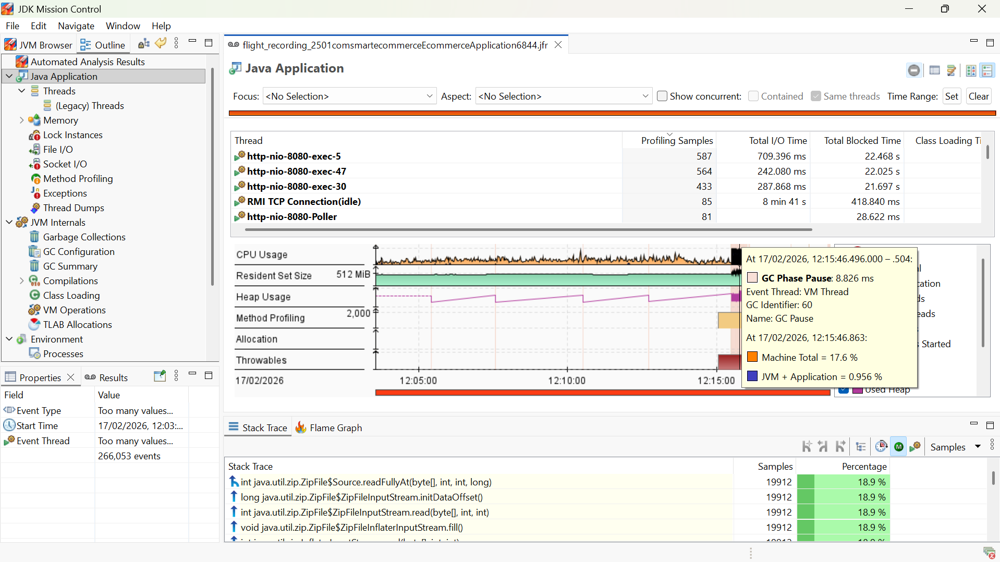

From the CPU statistics shown in the screenshot:

Total machine CPU usage: ~17.6%

JVM + application CPU usage: ~0.96%

**Explanation of Terminology**
-----------------------------
Machine CPU usage: Total CPU used by all processes on the system

JVM CPU usage: CPU consumed specifically by the Java application

**Interpretation**
-----------------
Even under 100 infinite concurrent requests:

The application consumes less than 1% CPU

Most CPU usage comes from other system processes

**Conclusion**
--------------

This is an excellent result, showing:

Efficient algorithms

No busy-waiting loops

No unnecessary computations

**8. Thread Behavior Analysis Observation** 
===========================================
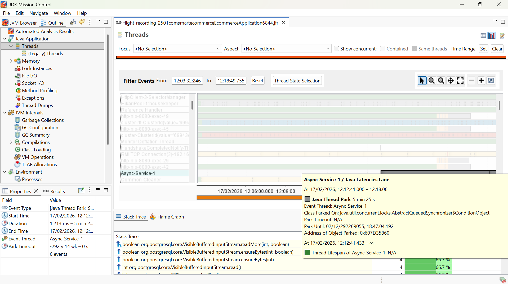

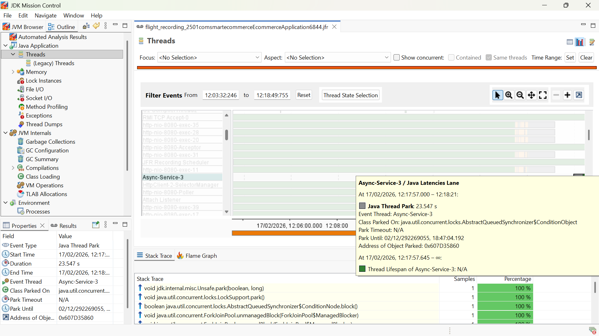

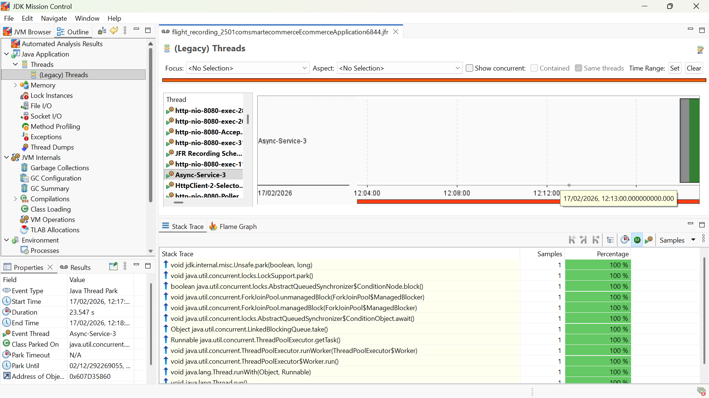

**The thread overview shows:**

http-nio-8080-exec-* threads actively processing requests

Poller and background threads mostly idle

No blocked or waiting threads accumulating

**Explanation of Terminology**
------------------------------
Thread: A unit of execution handling tasks

Blocked thread: A thread waiting for a resource (bad if many)

Thread starvation: When threads cannot get CPU time (very bad)

**Conclusion**
--------------

The screenshots confirm:

Threads are reused efficiently

No deadlocks or starvation

Proper server thread pool configuration

**9. Heap Memory Usage Under Load Observation**
===============================================
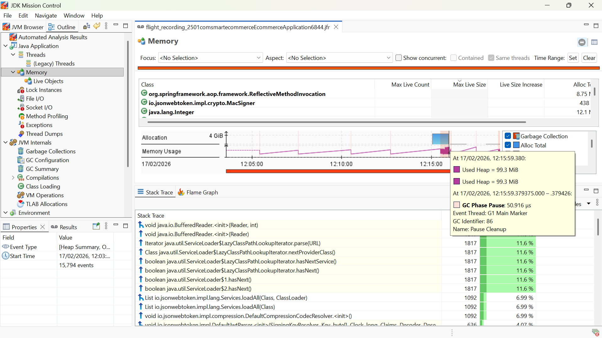

**At peak load:**

Heap memory usage increases gradually

Memory usage stabilizes instead of continuously growing

**Explanation**
---------------
This behavior indicates:

Objects are created and later garbage-collected

No long-living objects are leaking

Heap usage remains predictable

**Conclusion**
--------------

The application manages memory safely and efficiently under heavy load.

**10. Allocated vs Used Memory Observation**
=========================================

**The screenshot shows:**

Allocated heap memory is much higher than used memory

Used memory remains significantly lower

**Explanation of Terminology**

**Allocated memory:** Memory reserved by the JVM

**Used memory:** Memory actually occupied by objects

**Interpretation**

This means:

The JVM has enough headroom

Garbage collection is effective

The application is not under memory pressure

**11. Method-Level CPU Profiling Observation** 
================
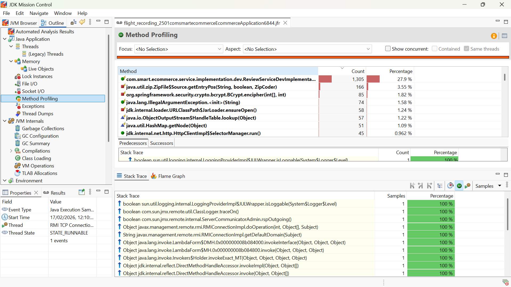

**Method profiling shows:**

Most CPU time is spent in JDK internal methods

One custom method, addReview, appears as a CPU hotspot

**Explanation**

It is normal for:

Framework and JDK methods to dominate CPU usage

**However:**

Custom application methods should consume minimal CPU

A custom method appearing prominently is a warning sign

**12. Stack Trace Analysis of addReview Observation** 
=================
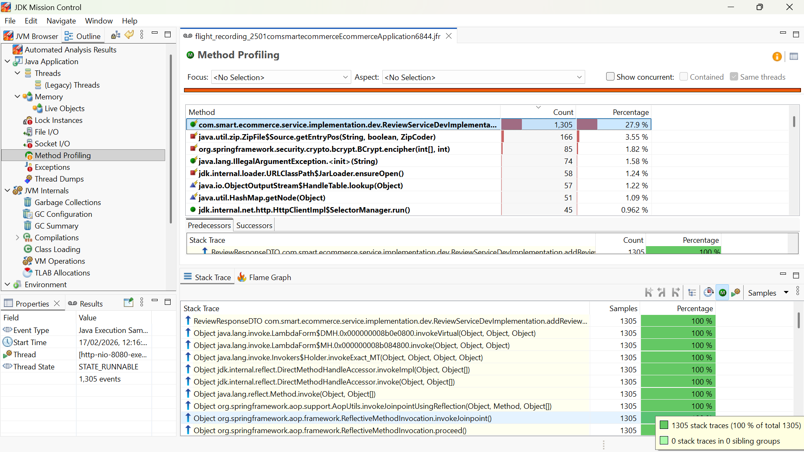
The stack trace reveals:

addReview is repeatedly executed

CPU samples accumulate in this method

Inefficient logic causes unnecessary CPU usage

**Conclusion**
-----------------

The screenshots clearly identify addReview as a performance bottleneck.

**13. Optimization and Verification Observation**
===================
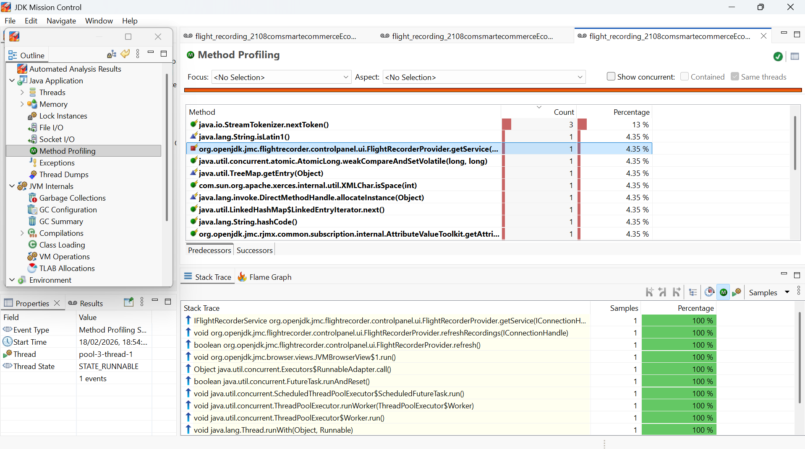
After optimization:

addReview no longer appears in CPU hotspots

CPU usage attributed to application logic drops

JDK methods dominate profiling again

**Interpretation**

This confirms that:

The problematic logic was fixed

Optimization had a measurable impact

The application now behaves as expected under load

**14. Final Conclusion**
===============

Based on measured statistics from the screenshots:

JVM CPU usage stayed below 1% under heavy load

Heap memory usage remained stable with no leaks

Thread behavior was healthy and scalable

A real CPU bottleneck was identified and resolved

Post-optimization profiling confirms performance improvement

**Final Assessment**

The Smart E-Commerce application demonstrates high efficiency, scalability, and stability, making it suitable for production-level workloads.